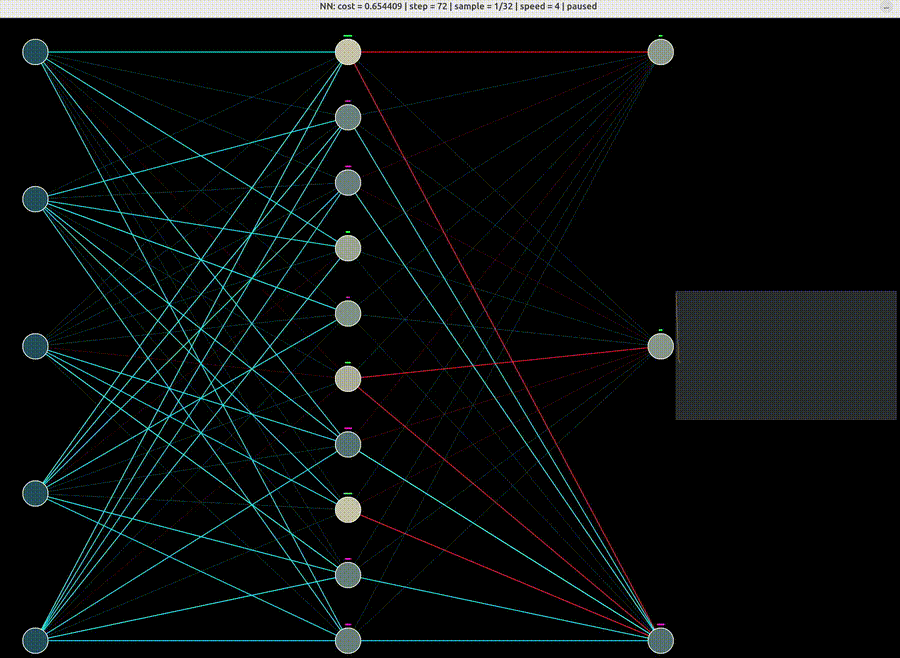

# ml_c

C experiments for neural networks.


## Demo
[](assets/demo.webm)

## Build

```sh
./build.sh
```

For the neural-net examples:

```sh
cd nn
./build.sh
```

The visual programs use SDL2, so `sdl2-config` must be available.

## Run

```sh
cd nn
./nn
./visual
or
./more
```

These programs print training progress and the final learned outputs. The visualizer shows the adder network training over time.
